## 什么是Transformer

Transformer是一个基于**纯注意力机制**的网络模型，它没有运用循环或是卷积神经网络

整体的结构为一个**编码器-解码器**

## 网络架构
**编码器-解码器结构**：

编码器会将序列中的每一个词表示成一个单独的向量（输出）；
解码器拿到编码器的输出之后生成一个新的序列（和原始序列长度不一定相等），编码的时候可以一次性全部生成，
而解码的时候只能够一个个来（自回归（过去时刻的输出可以看做当前时刻的输入）），
解码第n个词的时候可以看到前n-1个词的信息，这里类似于rnn。

`Add&Norm`：在每一个子层后面都加上一个这个，为了保证输入输出一致，这里设定每一个层输出的维度为512

`Norm`：每个子层的输出为：
$$
LayerNorm(x+Sublayer(x))
$$
`LayerNorm`：将单个样本（不同于`batchNorm`是对每个特征做正则化）内转换成均值为0，方差为1的格式（将每个值减去均值同时除以方差就行了）

`Add`：残差连接，作用有两个：

1. 降低模型复杂度，放置过拟合
2.  防止梯度消失

没做残差连接的梯度$\frac{\partial f(g(x))}{\partial x}=\frac{\partial f(g(x))}{\partial g(x)} \times \frac{\partial g(x)}{\partial x}$，网络层数很深之后容易导致梯度乘以接近0的数组从而让梯度消失。

加了残差连接的梯度：$\frac{\partial(f(g(x))+g(x))}{\partial x}=\frac{\partial f(g(x))}{\partial g(x)} \times \frac{\partial g(x)}{\partial x}+\frac{\partial g(x)}{\partial x}$，加了一项且值相对较大，即使是很深的网络也不容易导致梯度消失

解码器中的第一块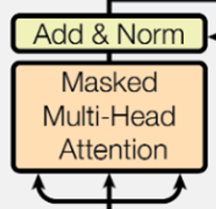：带掩码的注意力机制，保证在t时间不会看到t时间之后的哪些输入

**Attention**：

Attention的原理：

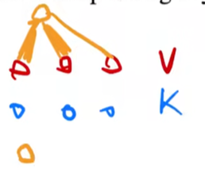

首先输出是三个v的累加，假如query和第一个key比较接近，那么输出的时候第一个value的权重就会比较大，远离第一个value的value权重就会慢慢变小
$$
\operatorname{Attempt}(Q,K,V)=\operatorname{softmax}(\dfrac{QK^T}{\sqrt{d_k}})V
$$
$d_k$指的是Q和K向量的维度，Q和K向量在编码器中的维度是一样的，长度可能不一，例如在解码器中由于Q是来自目标序列，因此不能保证Q和K的长度一致，向量的矩阵计算之后，做softmax就得到了对应的概率，相加为1

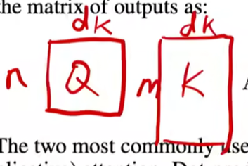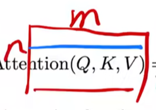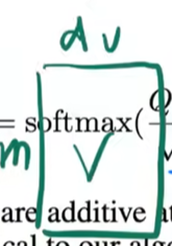

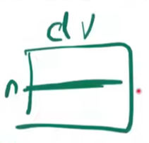

之所以要除以$\sqrt{{d}_{k}}$，是为了防止向量做点积的时候$d_k$很长时某些值过大导致softmax时概率更趋于1从而导致梯度变得很小，训练不动

一整个的计算流程：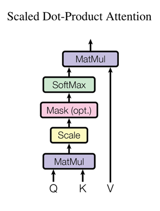

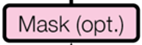这里的Mask是可选的，只有在解码器的时候有用到，用处是防止模型关注当前t时刻后面的信息，具体做法是给t时刻后面的这一块计算结果换成一个非常大的负数，那么在softmax中的指数计算就会趋近于0，其权重就会变成0，在之后与V的计算时就相当于是不参与计算了

**多头注意力机制**：

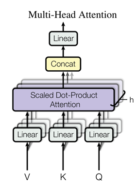

之所以要使用多头注意力机制，是因为在原来单个注意力机制中，没有什么能够学习的参数，整个流程都是给定的，因此在多头注意力计算中，将V、K、Q做线性投影到低维，投影时给定的投影矩阵W是可以学习的，同时有h个这样的结构，相当于给了h次学习的机会，希望能够学到不一样的一些信息，最后拼接起来再投影回去
$$
\begin{array}{c}\mathrm{MultiHead}(Q,K,V)=\mathrm{Concat}(\mathrm{head}_1,...,\mathrm{head}_n)W^O\\ \mathrm{where head}_i=\mathrm{Atention}(QW_i^Q,KW_i^K,VW_i^V)\end{array}
$$
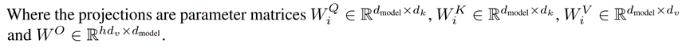

这里h=8，$\:d_{k}=d_{v}=d_{\mathrm{model}}/h\stackrel{}{=}64$

## 模型的大体结构

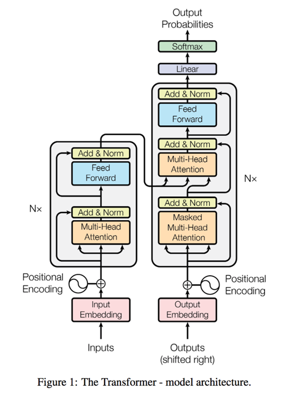

之所以是自注意力机制，是因为在进入多头注意力层的时候，同样的向量复制成了三份，分别作为K、Q、V。

假定输入为长度为n的一个序列，向量化之后变为矩阵大小为n*d，输出大小也一致，输出的每一个向量都是输入的所有向量的加权累加（就是softmax那一步乘以V向量）

解码器第一个子层的输出会被当做Q向量输入进第二个子层，其输入是另一个序列（机器翻译中的翻译结果）

Transformer模型在训练和投入使用时的模式是不一样的，训练时由于知道目标输出序列，因此做mask后可以并行进行计算，但实际使用时是一个个单词输出的，每预测一次都会加大解码器输入序列的长度（开始的时候是0？）

**Feed-forward（前馈神经网络）**：

具体公式描述：$\operatorname{FFN}(x)=\max(0,xW_1+b_1)W_2+b_2$

包含两个线性变换和一个Relu激活，transformer在这边对每个向量都会用相同的参数应用一次，之所以不对整个矩阵作用，是因为之前的Attention已经把每个向量的信息提取出来并aggregation了

内层维度为$d_{model}$的4倍，在这里就是2048，外层又映射回512

空间复杂度为n\*dff，dff = 4\*$d_{model}$，因为要保存每个向量的计算结果

**Embedding**：

就是将词映射为一个向量，这里将权重乘了一个$\sqrt{d_{\textit{model}}}$

**Positional Encoding**：**加入时序信息**

首先将位置信息encoding，然后把它加进encoding后的原始数据中

将词所在位置信息encoding进原始信息中

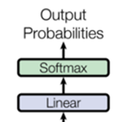:第一个线性层是一个简单的全连接神经网络，它将解码器输出的向量投影到一个更大的向量中，相当于是单词表吧，每个向量的位置代表一个单词，之后经过一个softmax输出每个单词的概率，概率最高的作为模型的输出。
